# 📊 GamePredict AI Agent - System Flow Charts

## 🎯 **1. AI Agentic Decision Making Flow**

```mermaid
flowchart TD
    A[🎮 Game Data Input] --> B[📊 ESPN API Collection]
    B --> C[🔍 H2H Historical Analysis]
    C --> D{📈 H2H Quality Check}
    
    D -->|≥5 matches| E[✅ High Quality H2H Data]
    D -->|<5 matches| F[🎲 Realistic Fallback Data]
    
    E --> G[⚡ Statistical Analysis]
    F --> G
    
    G --> H[🤖 AI Agentic Enhancement]
    H --> I{🧠 GPT-4 Available?}
    
    I -->|Yes| J[🎯 Contextual Analysis]
    I -->|No| K[📊 Statistical Only]
    
    J --> L[🔄 Combine 80% H2H + 20% AI]
    K --> M[📈 100% Statistical]
    
    L --> N{🛡️ Confidence ≥ 75%?}
    M --> N
    
    N -->|Yes| O[✅ RECOMMEND BET]
    N -->|No| P[❌ REJECT - Protect Capital]
    
    O --> Q[💰 Present to User]
    P --> R[🚫 Hidden from User]
    
    style N fill:#ff9999
    style O fill:#99ff99
    style P fill:#ffcc99
```



---

## 🏗️ **2. Multi-Sport System Architecture**

```mermaid
flowchart LR
    subgraph "Data Sources"
        A1[🏈 ESPN NFL/NCAA API]
        A2[🏀 ESPN NBA API]
        A3[⚽ ESPN Soccer API]
        A4[💰 LiveScore API]
        A5[🎯 The-Odds API]
    end
    
    subgraph "H2H Collectors"
        B1[🏈 American Football H2H]
        B2[🏀 NBA H2H Collector]
        B3[⚽ Soccer H2H Collector]
    end
    
    subgraph "AI Agentic Predictors"
        C1[🏈 American Football Predictor]
        C2[🏀 NBA Predictor]
        C3[⚽ Dual-Mode Soccer Predictor]
    end
    
    subgraph "AI Enhancement Modules"
        D1[🤖 American Football Agentic AI]
        D2[🤖 NBA Agentic AI]
        D3[🤖 Soccer Contextual AI]
    end
    
    A1 --> B1
    A2 --> B2
    A3 --> B3
    A4 --> B3
    
    B1 --> C1
    B2 --> C2
    B3 --> C3
    
    D1 --> C1
    D2 --> C2
    D3 --> C3
    
    C1 --> E[🎯 Working Multi-Sport Predictor]
    C2 --> E
    C3 --> E
    
    E --> F{🛡️ 75% Confidence Filter}
    F -->|Pass| G[✅ High-Confidence Recommendations]
    F -->|Fail| H[❌ Rejected for User Protection]
    
    G --> I[🚀 FastAPI Service]
    I --> J[💻 User Interface]
    
    style F fill:#ff9999
    style G fill:#99ff99
    style H fill:#ffcc99
```



---

## 🔄 **3. Real-Time Prediction Process Flow**

```mermaid
sequenceDiagram
    participant U as 👤 User
    participant API as 🚀 FastAPI Service
    participant MSP as 🎯 Multi-Sport Predictor
    participant AF as 🏈 American Football
    participant NBA as 🏀 NBA System
    participant SOC as ⚽ Soccer System
    participant AI as 🤖 AI Enhancement
    
    U->>API: Request High-Confidence Predictions
    API->>MSP: get_all_high_confidence_predictions()
    
    par American Football Analysis
        MSP->>AF: generate_daily_predictions()
        AF->>AF: Collect ESPN NFL/NCAA data
        AF->>AF: Analyze H2H patterns
        AF->>AI: enhance_prediction() [if available]
        AI-->>AF: Contextual insights
        AF->>AF: Apply 75% confidence filter
        AF-->>MSP: High-confidence predictions only
    and NBA Analysis
        MSP->>NBA: generate_daily_predictions()
        NBA->>NBA: Collect ESPN NBA data
        NBA->>NBA: Analyze team H2H history
        NBA->>AI: enhance_nba_prediction() [if available]
        AI-->>NBA: Injury/rest analysis
        NBA->>NBA: Apply 75% confidence filter
        NBA-->>MSP: High-confidence predictions only
    and Soccer Analysis
        MSP->>SOC: get_daily_predictions()
        SOC->>SOC: ESPN/LiveScore data collection
        SOC->>SOC: Multi-league H2H analysis
        SOC->>AI: contextual_enhancement() [if available]
        AI-->>SOC: Form/weather insights
        SOC->>SOC: Apply 75% confidence filter
        SOC-->>MSP: High-confidence predictions only
    end
    
    MSP->>MSP: Combine all sport predictions
    MSP->>MSP: Final quality assessment
    MSP-->>API: Aggregated high-confidence results
    API-->>U: Only profitable, protected recommendations
    
    Note over U,AI: 🛡️ Capital Protection: Only 75%+ confidence bets shown
```



---

## ☁️ **4. AWS Deployment Architecture Flow**

```mermaid
flowchart TB
    subgraph "Internet Layer"
        A[🌍 Global Users]
        B[🔒 Route 53 DNS]
        C[🚀 CloudFront CDN]
    end
    
    subgraph "Security Layer"
        D[🛡️ AWS WAF]
        E[🔐 AWS Shield]
    end
    
    subgraph "API Layer"
        F[📡 API Gateway]
        G[🔑 Lambda Authorizer]
        H[⚖️ Application Load Balancer]
    end
    
    subgraph "Compute Layer"
        I[🐳 ECS Fargate Cluster]
        J[📦 GamePredict AI Containers]
        K[⚡ Auto Scaling Group]
    end
    
    subgraph "Data Layer"
        L[🗄️ RDS Aurora Serverless]
        M[⚡ ElastiCache Redis]
        N[📁 S3 Bucket Storage]
    end
    
    subgraph "AI/ML Layer"
        O[🤖 SageMaker Endpoints]
        P[🧠 AWS Bedrock]
        Q[⚙️ Lambda Functions]
    end
    
    subgraph "Monitoring Layer"
        R[📊 CloudWatch Logs]
        S[🚨 CloudWatch Alarms]
        T[📈 X-Ray Tracing]
    end
    
    A --> B
    B --> C
    C --> D
    D --> E
    E --> F
    F --> G
    G --> H
    H --> I
    I --> J
    J --> K
    
    J <--> L
    J <--> M
    J <--> N
    
    J <--> O
    J <--> P
    Q --> J
    
    J --> R
    R --> S
    J --> T
    
    style I fill:#e1f5fe
    style L fill:#f3e5f5
    style O fill:#e8f5e8
```



---

## 🚀 **5. AWS Migration Timeline Flow**

```mermaid
gantt
    title GamePredict AI Agent - AWS Migration Timeline
    dateFormat X
    axisFormat %w
    
    section Week 1: Infrastructure
    VPC & Security Setup     :done, w1-1, 0, 2d
    RDS Aurora Setup         :done, w1-2, 1d, 2d
    ElastiCache Deployment   :done, w1-3, 2d, 1d
    ECS Cluster Creation     :w1-4, 3d, 2d
    API Gateway Config       :w1-5, 4d, 1d
    
    section Week 2: Application
    Docker Containerization  :w2-1, 7d, 2d
    ECS Service Deployment   :w2-2, 8d, 2d
    Database Migration       :w2-3, 9d, 2d
    Load Balancer Setup      :w2-4, 10d, 1d
    SSL Certificate Config   :w2-5, 11d, 1d
    
    section Week 3: AI & Production
    SageMaker Integration    :w3-1, 14d, 2d
    Lambda Functions Deploy  :w3-2, 15d, 2d
    CloudWatch Monitoring    :w3-3, 16d, 1d
    Auto-scaling Config      :w3-4, 17d, 1d
    Production Testing       :w3-5, 18d, 2d
    Go-Live Launch          :milestone, 21d, 0d
```

---

## 🎯 **6. Confidence Filtering Decision Tree**

```mermaid
flowchart TD
    A[📊 Raw Prediction Generated] --> B{🔍 H2H Data Quality}
    
    B -->|≥8 matches| C[💎 Excellent Quality]
    B -->|5-7 matches| D[✅ Good Quality]
    B -->|3-4 matches| E[⚠️ Fair Quality]
    B -->|<3 matches| F[❌ Poor Quality]
    
    C --> G[📈 Base Confidence: 85-95%]
    D --> H[📈 Base Confidence: 75-85%]
    E --> I[📈 Base Confidence: 65-75%]
    F --> J[📈 Base Confidence: 50-65%]
    
    G --> K{🤖 AI Enhancement Available?}
    H --> K
    I --> K
    J --> K
    
    K -->|Yes| L[🎯 Apply GPT-4 Analysis]
    K -->|No| M[📊 Statistical Only]
    
    L --> N[🔄 Adjust Confidence ±10%]
    M --> O[📈 Keep Base Confidence]
    
    N --> P{🛡️ Final Confidence ≥ 75%?}
    O --> P
    
    P -->|Yes| Q[✅ SHOW TO USER]
    P -->|No| R[🚫 HIDE - PROTECT CAPITAL]
    
    Q --> S[💰 Profitable Recommendation]
    R --> T[🛡️ Capital Protected]
    
    style P fill:#ff9999
    style Q fill:#99ff99
    style R fill:#ffcc99
    style S fill:#c8e6c9
    style T fill:#ffecb3
```



---

## 💰 **7. Revenue Flow & Scaling**

```mermaid
flowchart LR
    subgraph "User Acquisition"
        A1[🎯 Free Trial Users]
        A2[💳 Premium Subscribers]
        A3[🏢 Enterprise Clients]
    end
    
    subgraph "AI Agentic Value"
        B1[🛡️ 75% Confidence Filter]
        B2[🤖 GPT-4 Enhancement]
        B3[📊 Multi-Sport Coverage]
        B4[⚡ Real-time Analysis]
    end
    
    subgraph "Revenue Streams"
        C1[💰 Monthly Subscriptions]
        C2[🏢 Enterprise Licensing]
        C3[📱 Mobile App Premium]
        C4[🔌 API Access Fees]
    end
    
    subgraph "AWS Scaling"
        D1[📈 Auto-scaling Infrastructure]
        D2[🌍 Global CDN Deployment]
        D3[🔒 Enterprise Security]
        D4[📊 Real-time Analytics]
    end
    
    A1 --> B1
    A2 --> B2
    A3 --> B3
    
    B1 --> C1
    B2 --> C2
    B3 --> C3
    B4 --> C4
    
    C1 --> D1
    C2 --> D2
    C3 --> D3
    C4 --> D4
    
    D1 --> E[🚀 Scale to 100K+ Users]
    D2 --> E
    D3 --> E
    D4 --> E
```



---

## 🔄 **8. AI Enhancement Process Flow**

```mermaid
flowchart TD
    A[🎮 Game Data Input] --> B[📊 Base Statistical Analysis]
    B --> C[🔍 Historical H2H Patterns]
    
    C --> D{🤖 AI Enhancement Mode}
    D -->|Enabled| E[🧠 GPT-4 Context Analysis]
    D -->|Disabled| F[📈 Statistical Only]
    
    E --> G[🌤️ Weather Analysis]
    E --> H[🏥 Injury Reports]
    E --> I[🏆 Playoff Stakes]
    E --> J[👥 Team Chemistry]
    E --> K[🏠 Home Field Advantage]
    
    G --> L[🔄 Contextual Weighting]
    H --> L
    I --> L
    J --> L
    K --> L
    
    L --> M[⚖️ 80% H2H + 20% AI Blend]
    F --> N[📊 100% Statistical]
    
    M --> O{🎯 Quality Assessment}
    N --> O
    
    O -->|Excellent| P[💎 90-95% Confidence]
    O -->|Good| Q[✅ 80-89% Confidence]
    O -->|Fair| R[⚠️ 70-79% Confidence]
    O -->|Poor| S[❌ <70% Confidence]
    
    P --> T{🛡️ Passes 75% Filter?}
    Q --> T
    R --> T
    S --> T
    
    T -->|Yes| U[✅ Recommend to User]
    T -->|No| V[🚫 Protect User Capital]
    
    style T fill:#ff9999
    style U fill:#99ff99
    style V fill:#ffcc99
```



---

## 📊 **How to Use These Flow Charts:**

### **For Stakeholders:**
- Share **Flow Chart #1** to explain AI decision making
- Use **Flow Chart #2** to show system architecture 
- Present **Flow Chart #4** for AWS deployment benefits

### **For Technical Teams:**
- Reference **Flow Chart #3** for implementation details
- Use **Flow Chart #5** for migration planning
- Follow **Flow Chart #6** for quality control logic

### **For Investors:**
- Show **Flow Chart #7** for revenue scaling potential
- Demonstrate **Flow Chart #8** for AI enhancement value

**🎯 These flow charts provide complete visual documentation of your AI Agentic betting system, perfect for presentations, technical discussions, and investor meetings!**